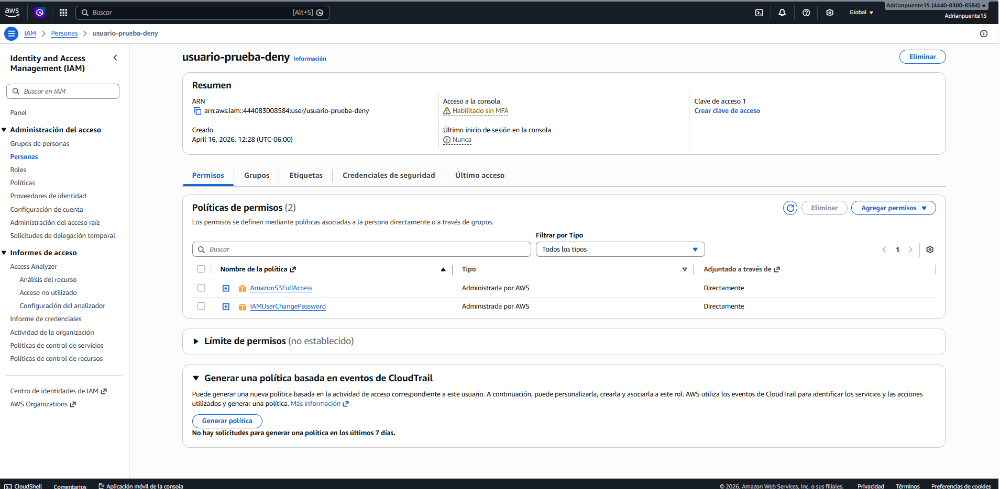
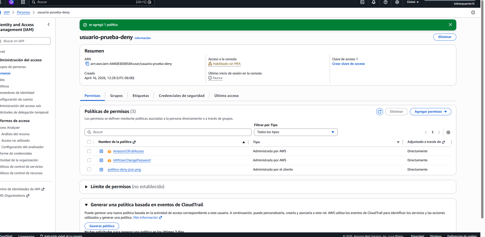
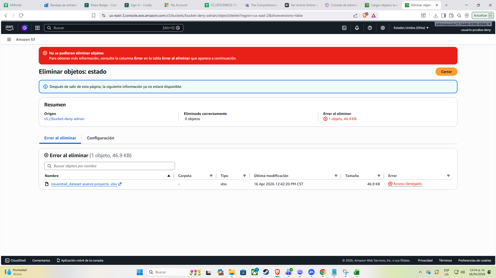
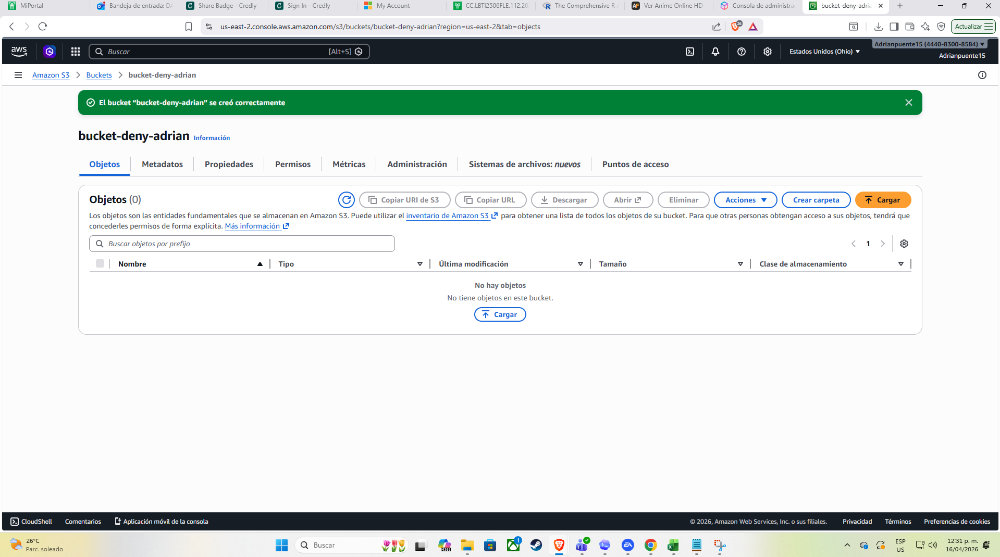

# AWS IAM - Control de acceso con DENY en S3

## Descripción

Práctica de implementación de control de acceso en Amazon S3 utilizando políticas IAM, aplicando reglas explícitas de DENY para reforzar la seguridad.

## Objetivo

Bloquear la eliminación de archivos en un bucket S3, incluso cuando el usuario tiene permisos completos.

## Escenario

Se creó un usuario con acceso completo a S3, pero se necesitaba evitar que pudiera eliminar archivos críticos dentro de un bucket específico.

## Problema identificado

El usuario podía eliminar archivos sin restricciones, lo que representaba un riesgo de pérdida de información.

## Solución implementada

Se creó una política personalizada con efecto DENY:

* Acción bloqueada: s3:DeleteObject
* Recurso: bucket específico

## Resultado

Al intentar eliminar un archivo:

* ❌ La acción fue bloqueada
* ❌ Se mostró el error "Access Denied"
* ✔️ El archivo no fue eliminado

## Evidencia

### Creación del bucket

### Política aplicada

### Intento de eliminación

### Resultado final

## Aprendizajes

* Prioridad de DENY sobre ALLOW en AWS IAM
* Implementación de controles de seguridad
* Validación de permisos en escenarios reales
* Importancia de restringir acciones críticas

## Herramientas utilizadas

* AWS IAM
* Amazon S3
* GitHub

